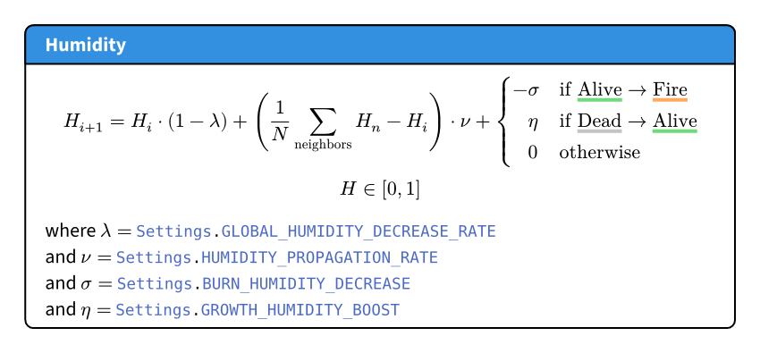

<h1 style="text-align: center">Ignis Silvae</h1>

    

<h4 style="text-align: center">A grid-based wildfire agent simulation in Scala.</h4>

This project is part of the 204.2 Computational Physics and 205.1 Functional Programming courses of the ISC Bachelor programme at HEI Sion.

---

<!-- TOC -->
* [Demo](#demo)
* [Usage](#usage)
  * [Installation](#installation)
  * [Controls](#controls)
* [Model](#model)
<!-- TOC -->

---

# Demo

     
    <a href="assets/demo.mp4">MP4 Video</a>

# Usage

## Installation

1. Simply clone this repository and open the project in IntelliJ
2. Run the `App` class

## Controls

When running the visualization, you can use the following controls:

- <kbd>Space</kbd>: Toggle fast mode (disabled by default)
- <kbd>1</kbd> or <kbd>S</kbd>: Show `State` layer
- <kbd>2</kbd> or <kbd>B</kbd>: Show `Burn Frequency` layer
- <kbd>3</kbd> or <kbd>F</kbd>: Show `Fire Probability` layer
- <kbd>4</kbd> or <kbd>G</kbd>: Show `Growth Probability` layer
- <kbd>5</kbd> or <kbd>H</kbd>: Show `Humidity` layer
- <kbd>6</kbd> or <kbd>A</kbd>: Show `Fire Age` layer
- <kbd>ESC</kbd>: Quit

# Model

Each cell of the automaton has a state (alive, on fire, dead or water, for lakes), and a humidity level.
This state and humidity update on each time step, for all cells, according to the following rules and formulae.

<figure style="text-align: center">
    
    <figcaption>Fig. 1 - Finite state machine</figcaption>
</figure>

---

Humidity is propagated across neighbors, and is globally decreased at each time step.
This is done to counterbalance the infinite humidity sources formed by lakes.

<figure style="text-align: center">
    
    <figcaption>Fig. 2 - Humidity evolution</figcaption>
</figure>

---

The probability of an alive cell catching fire is determined by the number of neighbors on fire and its own dryness.
A tree also has a small probability of spontaneously catching fire without any neighbor on fire.

<figure style="text-align: center">
    
    <figcaption>Fig. 3 - Fire probability computation</figcaption>
</figure>

---

The probability of a dead cell growing back is determined by the number of alive neighbors and its own humidity.
A tree also has a small probability of spontaneously growing without any alive neighbor.

<figure style="text-align: center">
    
    <figcaption>Fig. 4 - Growth probability computation</figcaption>
</figure>
